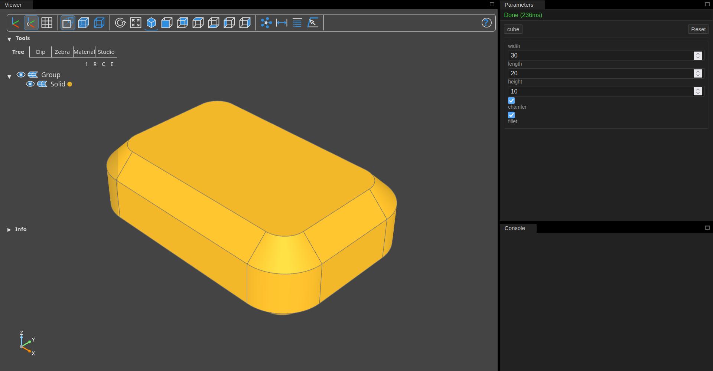

# Parameters Panel

The [`view` action][view] web UI includes a parameters panel. When your model
defines [parameters](index.md) and/or [presets](presets.md), controls for those
parameters and presets appear in the parameters panel.

The availabe parameters and presets in the parameters panel update as edits to
your model adds, changes, or removes parameters.

{ align=left }

??? Example "Source code"

    ```python
    #!/usr/bin/env python3
    from __future__ import annotations

    from typing import Any

    from build123d import Axis, Box, BuildPart, Plane, Select, chamfer, fillet

    from bdbox import Model, Preset


    class ExampleModel(Model):
        width: float = 30.0
        length: float = 20.0
        height: float = 10.0
        chamfer: bool = True
        fillet: bool = True
        presets = (Preset("cube", width=30.0, length=30.0, height=30.0),)

        def build(self) -> Any:
            with BuildPart() as p:
                Box(self.width, self.length, self.height)
                if self.fillet:
                    fillet(
                        p.edges(Select.LAST).filter_by(Axis.Z),
                        min(self.width, self.length) / 4,
                    )
                if self.chamfer:
                    chamfer(
                        p.edges().filter_by(Plane.XY),
                        min(min(self.width, self.length) / 8, self.height / 4),
                    )
            return p.part
    ```


## Starting the web UI

The web UI starts automatically with the `view` action:

=== "`bdbox` with **file**"

    ```sh
    bdbox model.py view
    ```

=== "`bdbox` with **module**"

    ```sh
    bdbox mypackage.mymodule view
    ```

=== "Direct with **file**"

    ```sh
    python model.py view
    ```

=== "Direct with **module**"

    ```sh
    python -m mypackage.mymodule view
    ```

With the `view` command running, the UI is available at:

[**http://localhost:4040**](http://localhost:4040){ .md-button .md-button--primary target="_blank" }

## Parameter controls

!!! Info Reminder

    A model declares [parameters](index.md) as class attributes just like
    with [dataclasses][dataclasses], using standard type annotations and/or the
    provided [field factory functions](fields.md).

Parameter controls are generated automatically from your model's parameter
definitions.

Changing any parameter value triggers an automatic model re-render with the
updated value applied.

## Presets

If your model defines [presets][presets], preset buttons appear above the
parameter form. Click a preset button to apply it — the parameter form updates
to the preset's values and the model re-renders automatically.

Click **Reset** to restore all parameters to their default values.

## Console

The console pane captures the model's standard error output, such as build
errors and tracebacks.

[presets]: presets.md
[view]: ../actions/view.md
